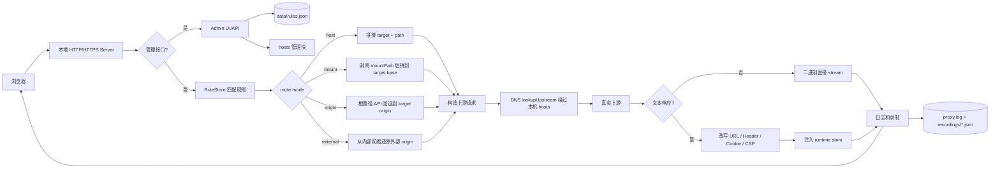
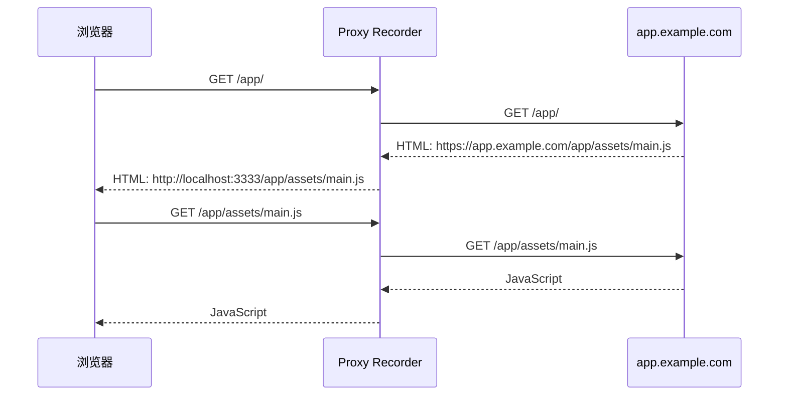
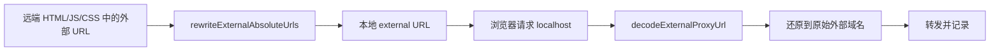
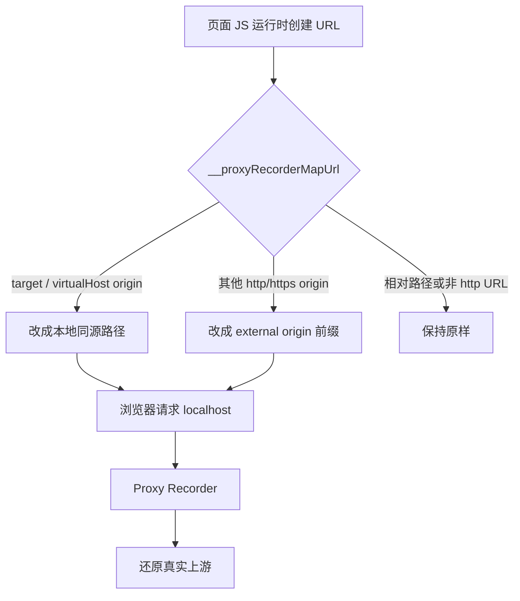
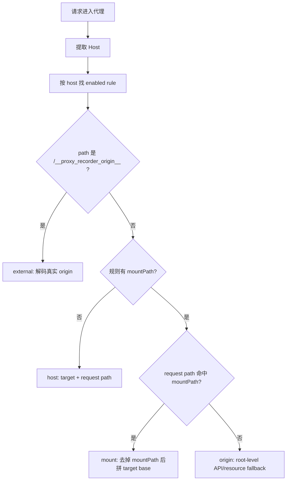
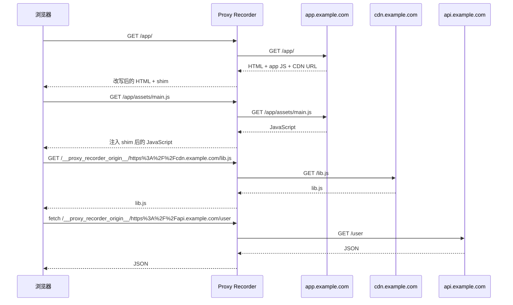
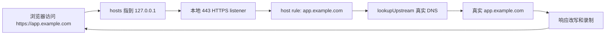
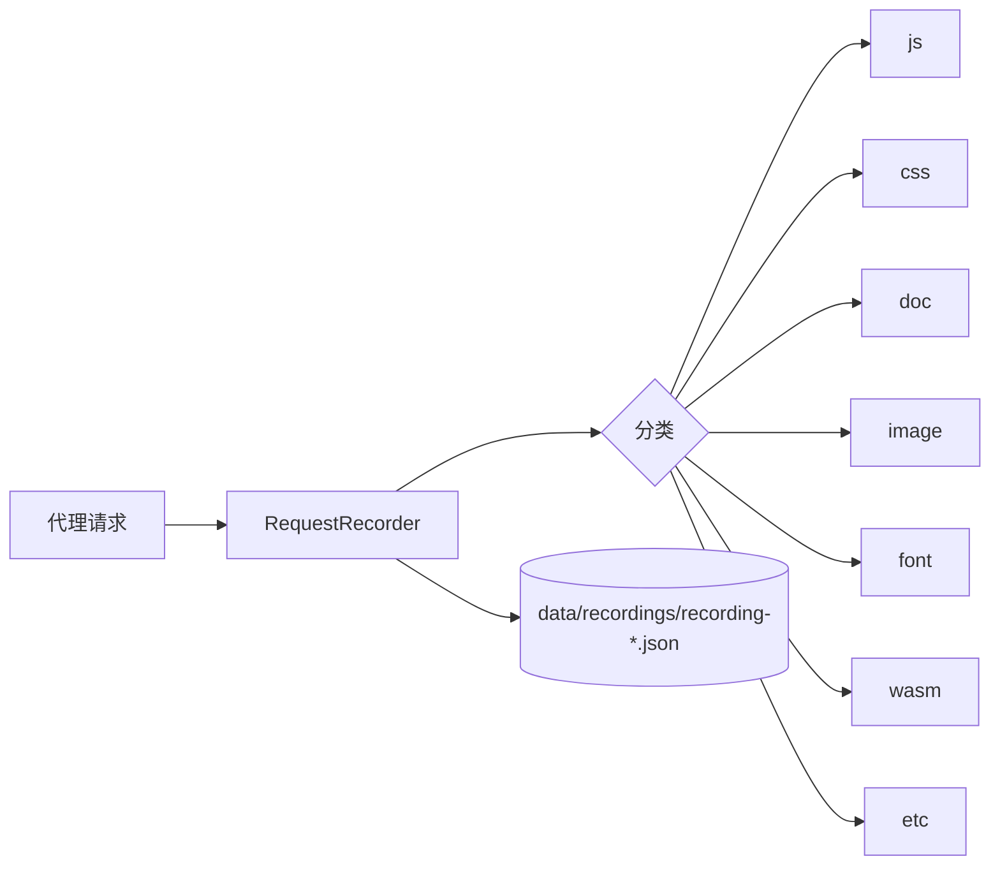

# Proxy Recorder

Proxy Recorder 是一个 Node.js + TypeScript 写的本地代理录制工具。它的目标不是只抓一个基础域名，而是让浏览器后续加载出来的 HTML、JS、CSS、图片、字体、Ajax、外部 CDN、第三方资源域名等请求，也尽量继续走本地代理，从而被统一转发、改写、记录和导出。

它适合做这些事情：

- 用本地地址访问远端站点，例如 `http://localhost:3333/app/` 代理到 `https://remote.example.com/app/`。
- 用 hosts + 本地证书把真实域名导到本机，例如 `https://app.example.com/` 先进本地代理，再转发到真实上游。
- 记录页面真实加载过的资源，按 `js/css/doc/image/font/wasm/etc` 分类导出。
- 调试 SPA 里动态生成的 API、CDN、图片、脚本、WebSocket URL 是否都被本地代理接住。

## 一句话结论

当前方案的通用基础是成立的：规则匹配、路径挂载、上游转发、文本改写、运行时 shim、外部域名回流、请求记录这些核心能力都是通用模块。

但它还不是“任意网站 100% 完备”的透明浏览器代理。它对常见 Web/SPA 站点可用性较好；遇到强 CSP、SRI、service worker、混淆脚本、复杂登录、证书绑定、大文件流式响应、特殊 WebSocket 协议时，仍需要按站点验证和补规则。

## 解决的问题

普通本地反向代理经常只能代理第一个域名，后续资源会漏出去：

```text
浏览器访问本地代理:
http://localhost:3333/app/

远端 HTML/JS 里继续出现:
https://remote.example.com/app/main.js
https://cdn.example.com/lib.js
https://assets.other.com/a.png
/api/user
/files/image.png
```

如果不改写，这些请求会直接打远端，代理录不到，也无法统一处理 cookie、跳转、CSP、跨域资源和本地调试环境差异。

Proxy Recorder 的做法是：

- 基础域名请求进入代理后，代理转发到 `target`。
- 文本响应返回浏览器前，先扫描并改写 URL。
- 对同源远端 URL，改成本地代理 URL。
- 对其他 HTTP(S) 域名，改成内部外部域名前缀：`/__proxy_recorder_origin__/...`。
- 对运行时才生成的 URL，注入 shim 拦截 `fetch`、`XMLHttpRequest`、`EventSource`、`WebSocket` 和常见 DOM URL 属性。
- 后续浏览器请求再回到代理时，代理根据 route mode 还原真实上游 URL。
- 每条代理请求都写 access log，录制开启时还会写入 recording export。

## 支持的代理模式

| 模式 | 浏览器访问 | 上游目标 | 适用场景 |
| --- | --- | --- | --- |
| Host HTTP | `http://host/path` | `http(s)://target/path` | hosts 指向本机，HTTP 调试 |
| Host HTTPS | `https://host/path` | `https://target/path` | hosts + mkcert，模拟真实 HTTPS 域名 |
| 显式 CONNECT | 浏览器系统代理发出 `CONNECT host:443` | 目标站点 socket | 浏览器代理模式 |
| 本地路径挂载 | `http://localhost:3333/app/` | `https://remote.example.com/app/` | 不改 hosts，不配证书，调试远端 SPA |
| 外部域名回流 | `/__proxy_recorder_origin__/https%3A%2F%2Fcdn.example.com/lib.js` | `https://cdn.example.com/lib.js` | 页面后续引用了其他域名 |

## 核心数据流



## 为什么不只代理基础域名

关键点是“浏览器只能请求本地，代理再还原真实上游”。因此，页面中出现的后续远端 URL 需要被改成本地 URL。

### 1. 同源远端 URL 改写

如果当前规则是：

```text
Host: localhost
Target: https://app.example.com/app
Mount: /app/
```

远端返回：

```html
<script src="https://app.example.com/app/assets/main.js"></script>
```

代理返回给浏览器前改成：

```html
<script src="http://localhost:3333/app/assets/main.js"></script>
```

浏览器后续请求本地：

```text
GET http://localhost:3333/app/assets/main.js
```

代理再还原为上游：

```text
GET https://app.example.com/app/assets/main.js
```

流程图：



### 2. 其他域名 URL 改成 external origin 前缀

如果页面里有另一个域名：

```html
<script src="https://cdn.example.com/lib.js"></script>

```

这些域名不是基础 `target`，不能直接改成 `/app/...`。所以代理会改成带 origin 信息的本地 URL：

```text
http://localhost:3333/__proxy_recorder_origin__/https%3A%2F%2Fcdn.example.com/lib.js
http://localhost:3333/__proxy_recorder_origin__/https%3A%2F%2Fassets.other.com/a.png
```

浏览器请求本地前缀后，代理从路径里解码出真实 origin：

```text
/__proxy_recorder_origin__/https%3A%2F%2Fcdn.example.com/lib.js
  -> origin = https://cdn.example.com
  -> path = /lib.js
  -> upstream = https://cdn.example.com/lib.js
```

流程图：



### 3. 运行时才生成的 URL 由 shim 接住

很多 SPA 不会把所有 URL 写死在 HTML 里，而是在 JS 运行时生成：

```js
fetch("https://api.example.com/user");
xhr.open("GET", "https://api.example.com/orders");
img.src = "https://assets.example.com/avatar.png";
new WebSocket("wss://socket.example.com/ws");
```

这些 URL 可能不会出现在初始 HTML 里。Proxy Recorder 会在 HTML/JS 文本响应里注入 runtime shim，拦截常见出口：

- `fetch`
- `XMLHttpRequest.open`
- `EventSource`
- `WebSocket`
- `Element.prototype.setAttribute`
- `img.src`、`script.src`、`link.href`、`form.action`、`source.srcset` 等常见 DOM 属性

运行时映射逻辑是：

```text
如果 URL 属于当前 target 或 virtualHost:
  https://app.example.com/app/api -> http://localhost:3333/app/api

如果 URL 属于其他 http(s) origin:
  https://api.example.com/user
  -> http://localhost:3333/__proxy_recorder_origin__/https%3A%2F%2Fapi.example.com/user

如果 URL 已经是本地 origin:
  保持不变

如果是相对路径:
  由浏览器按当前页面地址解析，必要时再被代理的 origin fallback 处理
```

流程图：



### 4. 根路径资源用 referer fallback 补救

有些外部页面会引用 root-relative 资源：

```html

<link href="/manifest.json">
```

如果当前页面本身是通过 external origin 打开的，浏览器请求 `/files/a.png` 时，路径里没有域名信息。当前实现会在部分路径上借助 `Referer` 找回上一个 external 页面对应的 origin。

示例：

```text
Referer:
http://localhost:3333/__proxy_recorder_origin__/https%3A%2F%2Fassets.example.com/page.html

Request:
GET /files/a.png

Proxy 推断:
https://assets.example.com/files/a.png
```

当前内置 fallback 路径包括：

- `/files/`
- `/pfile/`
- `/file/`

这部分是站点经验沉淀，不是完全通用规则。更好的优化方向是把这些前缀做成配置项。

## 路由模式如何选择



四种 route mode：

| route mode | 什么时候触发 | 上游 URL 例子 |
| --- | --- | --- |
| `host` | 普通 host-only 规则 | `target.pathname + request.pathname` |
| `mount` | 请求 path 命中 `mountPath` | `target base + stripped mount path` |
| `origin` | mounted rule 没有命中 mount，但同 host 无 host-only rule | `target.origin + request.pathname` |
| `external` | 请求 path 带 external origin 前缀，或 referer fallback 成功 | 解码后的外部 URL |

## 规则字段

```json
{
  "host": "localhost",
  "target": "https://app.example.com/app",
  "mountPath": "/app/",
  "virtualHost": "app.example.com",
  "enabled": true,
  "hostsEnabled": false
}
```

字段说明：

- `host`：浏览器请求进本地代理时的 host。路径挂载通常用 `localhost`。
- `target`：真实上游 base URL。
- `mountPath`：本地挂载路径。请求 `/app/assets/a.js` 会映射到 target base 下的 `/assets/a.js`。
- `virtualHost`：可选。给 runtime shim 使用，让站点 JS 里围绕线上域名构造的 URL 也能被识别。
- `enabled`：规则是否参与代理匹配。
- `hostsEnabled`：点击“应用 hosts”时是否写入 hosts 文件。`localhost` 路径挂载通常不需要写 hosts。

## 典型数据流示例

### 本地路径挂载 SPA

```text
浏览器:
http://localhost:3333/app/#/

规则:
host = localhost
target = https://app.example.com/app
mountPath = /app/
```



### hosts + HTTPS 真实域名拦截

```text
hosts:
127.0.0.1 app.example.com

浏览器:
https://app.example.com/

本地代理:
HTTPS_PROXY_PORT=443
TLS_CERT_PATH=本地可信证书
```



这里必须有本地可信证书。原因是浏览器访问的是 HTTPS，TLS 握手发生在 HTTP 请求之前；普通 HTTP 代理不能透明处理 `https://host`。

本地入口协议和上游协议是独立的：浏览器可以访问本机 `https://...`，规则里的 `Target` 可以写 `http://origin.example.com` 或 `https://origin.example.com`。代理会按 `Target` 的 scheme 自动选择 Node 的 `http` 或 `https` 客户端转发；返回给浏览器的 HTML/JS/CSS 仍会改写成本地 HTTPS origin。

## 安装和运行

```bash
npm install
npm run build
```

开发启动：

```bash
npm run dev
```

默认管理地址：

```text
http://localhost:3333/admin
```

指定开发端口：

```bash
PROXY_PORT=8080 npm run dev
```

PowerShell：

```powershell
$env:PROXY_PORT=8080; npm run dev
```

Windows CMD：

```bat
set PROXY_PORT=8080 && npm run dev
```

生产构建后启动：

```bash
npm run build
npm start
```

本地调试建议只监听本机：

```bash
BIND_HOST=127.0.0.1 npm run dev
```

## 路径挂载使用方式

打开管理界面：

```text
http://localhost:3333/admin
```

添加规则：

```text
Host: localhost
Target: https://app.example.com/app
Mount: /app/
Virtual Host: app.example.com
Enabled: checked
Write hosts: unchecked
```

访问：

```text
http://localhost:3333/app/
```

如果远端是 hash router，浏览器地址可能是：

```text
http://localhost:3333/app/#/
```

注意：`#/` 是浏览器 fragment，不会发给服务器，代理日志里通常只能看到 `/app/`。

## hosts + HTTPS 使用方式

创建并信任本地证书，例如：

```bash
mkcert install
mkcert app.example.com
```

启动 80/443：

```bash
sudo env \
  HOSTS_PATH=/etc/hosts \
  PROXY_PORT=80 \
  HTTPS_PROXY_PORT=443 \
  TLS_CERT_PATH="$(pwd)/app.example.com.pem" \
  TLS_KEY_PATH="$(pwd)/app.example.com-key.pem" \
  npm start
```

管理界面添加规则：

```text
Host: app.example.com
Target: https://app.example.com
Enabled: checked
Write hosts: checked
```

如果真实上游是 HTTP，也可以直接写：

```text
Host: app.example.com
Target: http://origin.example.com
Enabled: checked
Write hosts: checked
```

点击“应用 hosts”，然后访问：

```text
https://app.example.com/
```

请求链路：

```text
browser -> 127.0.0.1:443 -> Proxy Recorder -> DNS 真实解析 -> https://app.example.com
```

HTTP 上游时链路对应为：

```text
browser -> 127.0.0.1:443 -> Proxy Recorder -> http://origin.example.com
```

## 配置项

| 变量 | 默认值 | 说明 |
| --- | --- | --- |
| `PROXY_PORT` | `8080`，`npm run dev` 下为 `3333` | HTTP server 端口，承载管理 UI 和 HTTP 代理流量。 |
| `HTTPS_PROXY_PORT` | 未设置 | 可选 HTTPS proxy 端口，通常是 `443`。需要同时提供 `TLS_CERT_PATH` 和 `TLS_KEY_PATH`。 |
| `BIND_HOST` | `0.0.0.0` | 监听地址。本地开发建议设置为 `127.0.0.1`。 |
| `DATA_DIR` | `./data` | 规则、录制文件等数据目录。 |
| `HOSTS_PATH` | 系统默认 | macOS/Linux 为 `/etc/hosts`，Windows 为 `%SystemRoot%\System32\drivers\etc\hosts`。 |
| `HOSTS_IP` | `127.0.0.1` | 写入 hosts 管理块的 IP。 |
| `TLS_CERT_PATH` | 未设置 | HTTPS listener 使用的证书路径。 |
| `TLS_KEY_PATH` | 未设置 | HTTPS listener 使用的私钥路径。 |
| `LOG_PATH` | `./data/proxy.log` | JSONL access log 路径。 |
| `MAX_REWRITE_BYTES` | `10485760` | 文本响应改写的最大 buffer 字节数；超过后流式转发但不改写 body。 |

## 录制与日志

每个代理请求都会写一行 JSON 到 stdout 和 `LOG_PATH`。管理 UI 也会显示最近日志。

录制开启后，代理会记录到达上游路径的请求：



导出文件包含：

- `startedAt`、`endedAt`
- `total`
- `categories`
- `requests`
- 每条请求的 `url`、`method`、`status`、`category`、`ts`

## 通用性边界

可以比较直接复用的站点：

- 静态站点、传统服务端页面、常见 SPA。
- 资源主要来自相对路径、同源绝对 URL、明确的第三方 HTTP(S) 域名。
- 登录态主要依赖 cookie、localStorage token 或 URL token。
- 不强依赖严格 CSP、SRI、service worker、cross-origin isolation。

需要额外验证或优化的站点：

- CSP/SRI/Trusted Types 很严格的站点。
- service worker 缓存和拦截逻辑很重的站点。
- 登录回调、SameSite/Secure cookie、第三方 OAuth 域名强绑定的站点。
- 大量 URL 在混淆 JS、wasm、worker 里动态构造的站点。
- 大文件、range request、媒体流、SSE、WebSocket 是主链路的站点。

当前已知的站点特化逻辑：

- HTML 注入中包含 Pinefield 相关 token localStorage 兼容。
- referer fallback 内置了 `/files/`、`/pfile/`、`/file/`。

这些逻辑能解决已知页面的问题，但未来最好改成规则级配置，避免影响其他站点。

## 优化方向

优先优化：

- 把 Pinefield token shim 改成可配置项，默认不注入。
- 把 `/files/`、`/pfile/`、`/file/` external fallback 前缀改成规则配置。
- 给 external origin proxy 增加 allowlist，避免服务暴露时变成开放代理。
- 默认 `BIND_HOST` 改为 `127.0.0.1`，或给 `0.0.0.0` 增加明显安全提示和管理鉴权。

中期优化：

- 用结构化 HTML/CSS parser 降低字符串改写误伤。
- 把 runtime shim 从长字符串抽成模板文件并增加单独测试。
- 增加 Playwright E2E，验证真实浏览器下所有请求是否都经过本地代理。
- 对超大文本响应设置大小阈值，超过阈值跳过改写或给出明确日志。
- 增强 WebSocket、range request、ETag/304、service worker 场景测试。

## 测试

```bash
npm test
```

当前测试覆盖：

- host 校验、重复规则、mounted rule 匹配和 origin fallback。
- URL 改写、外部 origin 前缀、referer fallback。
- runtime shim 注入后的 JavaScript 语法有效性。
- 请求录制分类和导出。
- hosts 管理块替换。
- 跨平台 dev launcher 和默认 hosts 路径。
- 上游 DNS lookup callback 形态。
