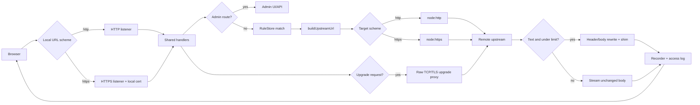
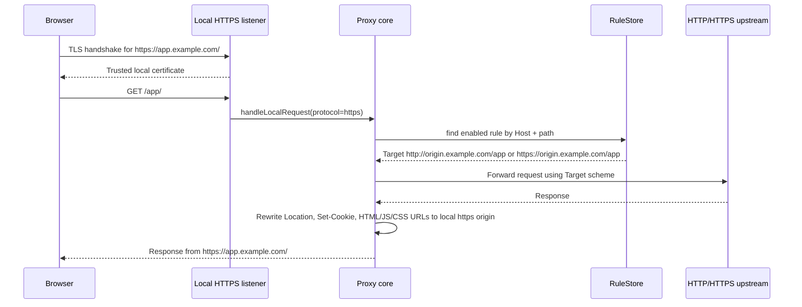
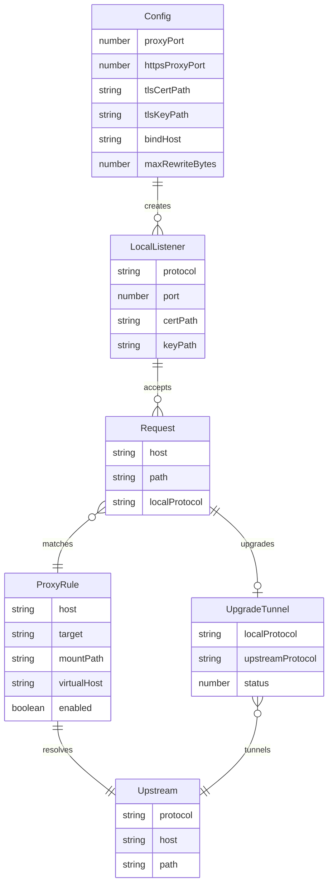
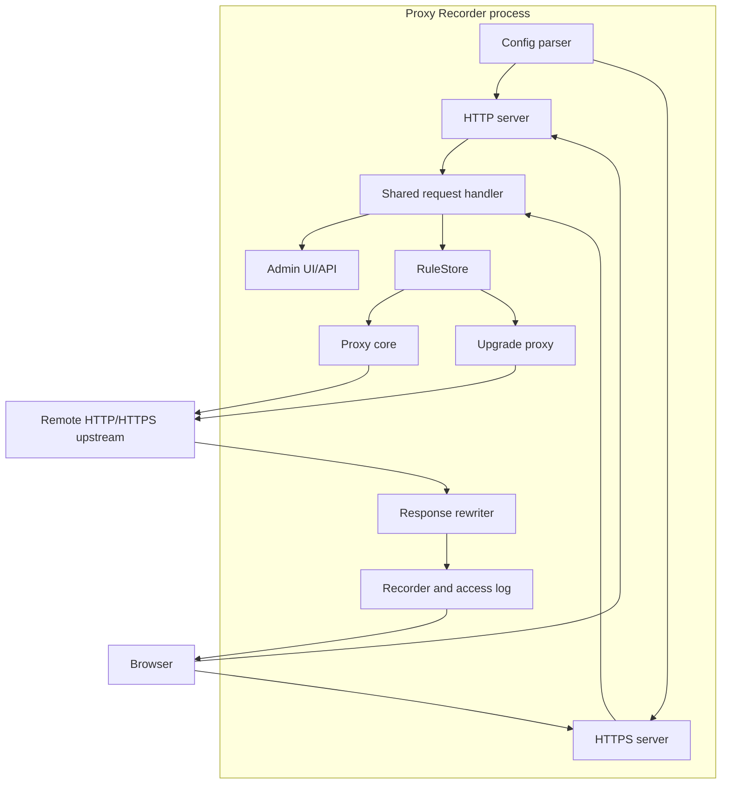

# HTTPS Local Proxy Support

## 问题是什么

已有能力是本机启动 HTTP listener，再把请求代理到远端 HTTPS 或 HTTP 上游。新需求是浏览器访问本机 HTTPS 地址时，也能进入同一套代理、改写、录制和管理逻辑，并且规则里的 `Target` 可以独立选择 `http://...` 或 `https://...`。

核心问题不是“上游是不是 HTTPS”，而是“浏览器到本机这一段是不是 HTTPS”。浏览器访问 `https://host/...` 时，TLS 握手发生在 HTTP 请求之前，所以本机必须有一个 HTTPS listener，并提供浏览器信任的证书。

## 影响是什么

不支持本机 HTTPS listener 时：

- hosts 指到本机后，`https://app.example.com/` 无法被普通 HTTP listener 接住。
- 浏览器会在 TLS 阶段失败，代理代码拿不到 HTTP 请求，也无法转发到远端。
- 真实域名 HTTPS 调试、cookie `Secure` 场景、线上同源环境模拟都会受限。

只做 HTTPS listener 但不复用 HTTP 逻辑时：

- HTTPS 入口可能漏掉管理 API、录制、CONNECT、WebSocket upgrade 或相同的错误处理。
- HTTP 和 HTTPS 两个入口的行为会逐渐漂移。
- 本地 HTTPS 到远端 HTTP 的场景容易被误认为不支持。

## 解决的核心思路

本地入口协议和上游协议解耦：

- 本地 HTTP listener 接收 `http://...` 请求。
- 本地 HTTPS listener 接收 `https://...` 请求，并用本地证书完成 TLS。
- 两个 listener 都调用同一个 `handleLocalRequest`，并注册相同的 `connect` 和 `upgrade` 处理。
- `handleLocalRequest` 只把本地协议标记为 `http` 或 `https`，传给代理层用于 `publicOrigin`、header、cookie、body URL 改写。
- 代理层根据规则 `Target` 的 URL scheme 选择 Node 的 `http` 或 `https` 客户端访问真实上游。
- WebSocket upgrade 使用 raw TCP/TLS socket 代理握手和后续双向字节流。
- 文本改写设置 `MAX_REWRITE_BYTES` 上限，超过阈值的文本响应流式转发，不再完整 buffer 到内存。
- HTTPS 配置必须成套提供：`HTTPS_PROXY_PORT`、`TLS_CERT_PATH`、`TLS_KEY_PATH`。

## 关键文件

| 文件 | 责任 |
| --- | --- |
| `src/server.ts` | 创建 HTTP/HTTPS listener，复用请求处理、admin、CONNECT、WebSocket upgrade 和端口错误处理。 |
| `src/proxy.ts` | 根据本地协议生成 `publicOrigin`；按上游 `Target` scheme 选择 `http`/`https` 客户端；处理 WebSocket upgrade；限制文本改写最大 buffer。 |
| `src/rules.ts` | 规则校验允许 `http://` 和 `https://` 上游目标；未写协议时默认补 `https://`。 |
| `src/config.ts` | 解析端口、校验 HTTPS 三件套、处理跨平台 hosts 默认路径、配置 `MAX_REWRITE_BYTES`。 |
| `src/config.test.ts` | 覆盖端口校验、HTTPS 配置完整性、Windows/macOS/Linux hosts 路径、正整数配置校验。 |
| `src/proxy.test.ts` | 覆盖本地 HTTPS origin 改写到 HTTP 上游目标、WebSocket upgrade 转发、大文本跳过改写。 |
| `src/rules.test.ts` | 覆盖显式 HTTP upstream target 不被改写成 HTTPS。 |

## 设计

本地 listener 负责接入协议，上游 URL 负责远端协议：

```text
browser scheme: http  -> HTTP local listener  -> proxy core -> target scheme: http or https
browser scheme: https -> HTTPS local listener -> proxy core -> target scheme: http or https
```

配置约束：

```text
HTTP-only:
PROXY_PORT=8080

HTTP + HTTPS:
PROXY_PORT=80
HTTPS_PROXY_PORT=443
TLS_CERT_PATH=./app.example.com.pem
TLS_KEY_PATH=./app.example.com-key.pem

Text rewrite memory guard:
MAX_REWRITE_BYTES=10485760
```

错误防线：

- `PROXY_PORT`、`HTTPS_PROXY_PORT` 必须是 `1..65535` 的整数。
- 只配置 HTTPS 三件套的一部分会直接启动失败并给出明确错误。
- `MAX_REWRITE_BYTES` 必须是正整数，默认 10 MiB。
- TLS 证书文件读取失败会在启动阶段暴露。

## 数据流动



## 调用时序图

普通 HTTPS 请求：



WebSocket upgrade：

```mermaid
sequenceDiagram
  participant B as Browser WebSocket
  participant L as Local HTTP/HTTPS listener
  participant P as Upgrade proxy
  participant R as RuleStore
  participant U as Upstream HTTP/HTTPS server

  B->>L: GET /app/socket with Upgrade: websocket
  L->>P: proxyUpgradeRequest(protocol=http or https)
  P->>R: match Host + path
  R-->>P: Target http(s)://origin/remote
  P->>U: Raw upgrade handshake to /remote/socket
  U-->>P: 101 Switching Protocols
  P-->>B: 101 Switching Protocols
  B<->U: Bidirectional tunneled bytes through local proxy
```

## 数据关系图



## 架构图



## 使用方法

安装和构建：

```bash
npm install
npm run build
```

创建并信任证书：

```bash
mkcert install
mkcert app.example.com
```

macOS/Linux 监听 80/443 通常需要管理员权限：

```bash
sudo env \
  HOSTS_PATH=/etc/hosts \
  PROXY_PORT=80 \
  HTTPS_PROXY_PORT=443 \
  TLS_CERT_PATH="$(pwd)/app.example.com.pem" \
  TLS_KEY_PATH="$(pwd)/app.example.com-key.pem" \
  npm start
```

Windows 下需要在管理员终端运行，或使用非特权端口，例如：

```powershell
$env:PROXY_PORT="8080"
$env:HTTPS_PROXY_PORT="3443"
$env:TLS_CERT_PATH="$PWD\app.example.com.pem"
$env:TLS_KEY_PATH="$PWD\app.example.com-key.pem"
npm start
```

添加 HTTPS 上游规则：

```text
Host: app.example.com
Target: https://app.example.com
Enabled: checked
Write hosts: checked
```

添加 HTTP 上游规则：

```text
Host: app.example.com
Target: http://origin.example.com
Enabled: checked
Write hosts: checked
```

访问：

```text
https://app.example.com/
```

链路分别是：

```text
browser -> local HTTPS listener -> proxy -> https://app.example.com
browser -> local HTTPS listener -> proxy -> http://origin.example.com
```

大文本响应阈值：

```bash
MAX_REWRITE_BYTES=$((10 * 1024 * 1024)) npm start
```

超过阈值的文本响应仍会代理返回，但不会做 HTML/JS/CSS URL 改写，也不会注入 runtime shim。这个取舍是为了避免超大文本资源把代理进程内存打满。

## 跨平台注意事项

- macOS/Linux 的系统 hosts 默认是 `/etc/hosts`。
- Windows 的系统 hosts 默认是 `%SystemRoot%\System32\drivers\etc\hosts`。
- 低端口 80/443 在 macOS/Linux 通常需要 `sudo`；Windows 通常需要管理员终端或端口保留配置。
- 路径处理使用 `path.resolve` 和 `path.win32.join`，避免硬编码 Windows 分隔符。
- PowerShell 设置环境变量和 POSIX shell 不同，文档中需要分别给出示例。
- 证书信任链由系统和浏览器决定；Firefox 可能需要单独导入或启用系统根证书信任。

## 单元测试覆盖

已覆盖：

- `defaultHostsPath` 在 macOS/Linux/Windows 下的路径选择。
- `parsePort` 对非法端口、空值、带后缀值、越界值的拒绝。
- `parsePositiveInteger` 对 `MAX_REWRITE_BYTES` 非法值的拒绝。
- `resolveHttpsProxyConfig` 对 HTTPS 三件套完整性的校验。
- 显式 `http://` target 会被规则层保留。
- 本地 HTTPS origin 下，HTTP upstream 资源 URL 会改写回本地 HTTPS origin。
- `buildUpstreamUrl` 能把本地 mount path 映射到 HTTP upstream base path。
- WebSocket upgrade 能从本地 mount path 转发到上游 base path，并透传隧道字节。
- 超过阈值的文本响应会跳过改写，避免 buffer 大文件。
- 现有 host/mount/external route、文本改写、录制、日志读取、hosts block 替换等回归测试。

## 测试遗漏和剩余风险

仍未覆盖：

- 真实 TLS socket 端到端测试，即启动 HTTPS listener 后用 Node HTTPS client 或浏览器访问。
- 真实浏览器证书信任、hosts 写入、DNS 绕过本机 hosts 的端到端流程。
- CONNECT over HTTPS proxy 的真实客户端兼容性；普通浏览器 hosts HTTPS 拦截不依赖这条路径。
- HTTPS upstream WebSocket 的真实 TLS upgrade 测试；当前实现等待 `secureConnect` 后再写入 handshake，但测试覆盖的是 HTTP upstream。
- HTTP/2 上游的扩展场景。普通 HTTPS 上游请求现在会先通过 ALPN 选择协议；协商到 `h2` 时走 Node `http2` 客户端，否则复用同一 TLS socket 回退到现有 HTTP/1.1 路径。当前测试覆盖 h2-only HTTPS 上游的 GET、响应头转换、文本改写和录制/日志主链路；尚未覆盖 HTTP/2 trailer、server push、长流式响应和大量并发 stream。
- 严格 CSP、SRI、service worker、证书绑定等站点策略。这些是浏览器和站点安全策略，不存在一个对任意站点通用的提前保证；可以做预检和端到端验收，但不能用单元测试证明所有站点都可代理。

可提前增加的站点预检：

- 抓取入口 HTML，检查 `Content-Security-Policy` 是否禁止 inline script 或限制 `connect-src` / `script-src`。
- 检查 HTML/JS 中是否出现 `integrity=`，SRI 会和响应改写冲突。
- 检查是否注册 service worker，例如 `navigator.serviceWorker.register(...)`。
- 检查响应头是否有 cross-origin isolation 相关策略。
- 对目标站点跑真实浏览器 E2E，断言主要资源、Ajax、WebSocket 请求都回到本地代理。

## 代码审查结论

必要修改：

- HTTPS listener 复用 HTTP handler 是必要的，否则本地 HTTPS 到远端 HTTP/HTTPS 的行为会和 HTTP 入口不一致。
- 配置校验是必要的，否则非法端口或半配置 TLS 会在不同平台产生不一致、难诊断的启动错误。
- HTTP upstream target 测试是必要的，因为默认 target 会补 `https://`，显式 `http://` 保留需要防回归。
- WebSocket upgrade 支持是必要的，因为 runtime shim 已经会改写 `WebSocket` URL；server 如果不处理 `upgrade`，页面会在运行时断链。
- 文本改写大小上限是必要的，否则超大 JS/HTML/CSS 会被完整 buffer 到内存。
- 文档中明确本地协议和上游协议解耦是必要的，否则使用者容易误以为本机 HTTPS 只能代理上游 HTTPS。

未发现由本次改动引入的阻断级问题。主要残留风险在真实 HTTPS E2E、HTTP/2-only 上游、浏览器安全策略和站点特定策略层。WebSocket upgrade 和大文本 buffer 风险已从“未实现/未控制”收敛为“已实现并有基础测试”。
