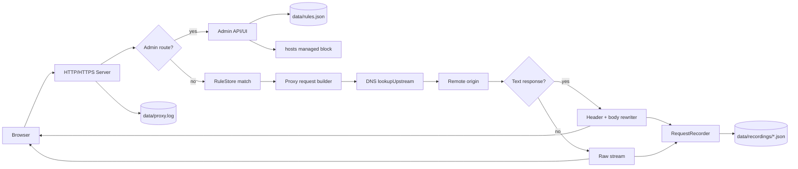
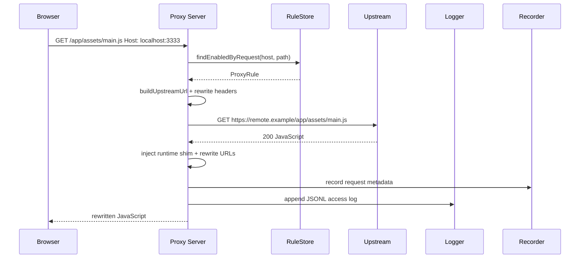
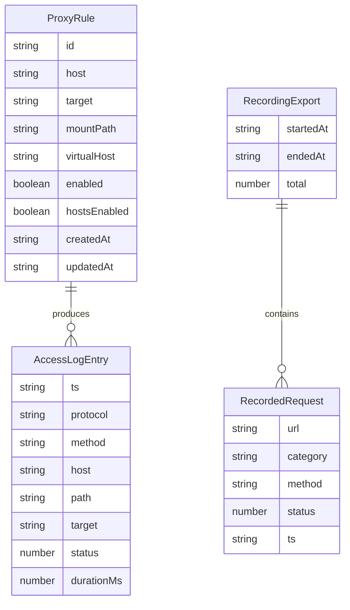
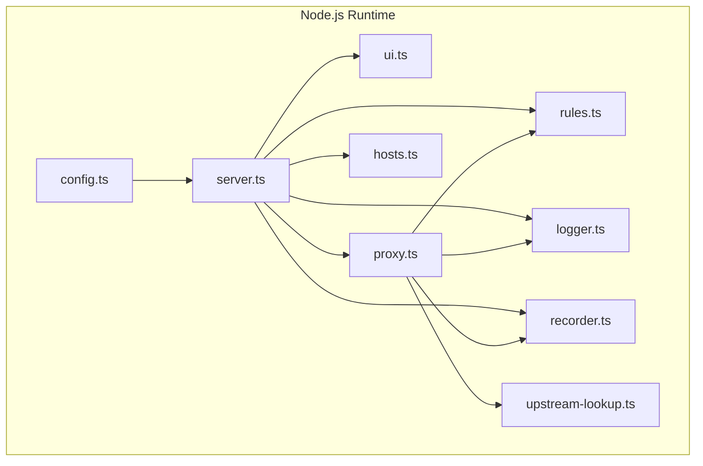

# Proxy Recorder 主功能说明

## 本轮 review 和优化结论

按要求做了 3 轮“review -> 修复 -> 验证”：

1. 第一轮发现管理日志读取对空文件和坏 JSONL 行不稳，`/api/logs` 可能因为单条损坏日志返回 500；同时 `npm run dev` 使用 `sh/lsof/kill`，不兼容 Windows。
2. 第二轮发现 host 校验只限制了整串首尾，没有限制每个 DNS label，`bad-.example`、`good.-bad.example` 这类非法 host 可能进入规则和 hosts 文件。
3. 第三轮发现 Windows 下默认 `HOSTS_PATH` 仍是 `/etc/hosts`，以及 README 对 dev 脚本行为的描述已经和跨平台实现不一致。

这些修改都是必要的：它们分别对应管理 UI 可用性、规则数据正确性、macOS/Windows/Linux 兼容性和文档一致性。未引入新依赖，改动集中在配置、日志读取、规则校验、开发启动脚本和文档。

## 问题是什么

Proxy Recorder 是一个 Node.js + TypeScript 代理录制工具，核心功能包括：

- 管理代理规则。
- 按 Host 或挂载路径把浏览器请求转发到远端站点。
- 对 HTML/JS/CSS/JSON/XML/SVG 等文本响应做 URL 和运行时 shim 改写。
- 可选写入 hosts 文件，实现本地域名拦截。
- 记录代理请求并导出资源清单。
- 在管理 UI 中查看最近访问日志。

本轮 review 聚焦的是边界可靠性：

- 日志文件可能不存在、为空，或因为写入中断产生坏行。
- host 输入会进入规则匹配、hosts 文件和代理转发，必须严格校验。
- 这是跨平台 Node 应用，开发脚本、路径拼接和默认 hosts 路径不能只按 macOS/Linux 写。
- 文档必须同步实现，否则使用者会按旧行为排查错误。

## 影响是什么

不修复时的影响：

- 管理 UI 的“最近日志”会因为空日志或坏日志行直接失败。
- 非法 host 可能被保存到规则文件，后续 hosts 写入、匹配和排障都会变复杂。
- Windows 用户无法运行原 `npm run dev`，因为原脚本依赖 POSIX shell 和 `lsof`。
- Windows 用户写 hosts 时默认路径错误，必须手动覆盖才可能成功。
- README 写着 dev 脚本会自动清理端口，但新跨平台实现不再做这个非便携行为，文档若不更新会误导使用者。

## 解决的核心思路

- 日志读取改成“容错读取”：缺失、空文件、非法 limit 返回空数组；坏 JSONL 行跳过，保留其他有效日志。
- host 校验改成逐 label 校验：每段 1-63 字符，只允许字母、数字、连字符，并禁止 label 以连字符开头或结尾。
- dev 脚本改成 `scripts/dev.mjs`：用 Node `spawn` 找到本地 `tsx`，并在 Windows 下使用 `tsx.cmd`；服务端对端口占用输出明确错误。
- 本地文件路径用 `path.join`，URL 拼接继续保留 URL/path 逻辑，避免 Windows 反斜杠污染 URL。
- 默认 hosts 路径封装为 `defaultHostsPath()`：macOS/Linux 返回 `/etc/hosts`，Windows 返回 `%SystemRoot%\System32\drivers\etc\hosts`。
- 对以上边界补单元测试，避免后续回归。

## 关键文件

- `package.json`: `dev` 脚本改为 `node scripts/dev.mjs`。
- `scripts/dev.mjs`: 跨平台开发启动器，默认 `PROXY_PORT=3333`，调用本地 `tsx watch src/server.ts`。
- `scripts/dev.test.mjs`: 覆盖 dev 启动器的跨平台二进制选择和默认端口环境变量。
- `src/config.ts`: 新增 `defaultHostsPath()`，按平台选择 hosts 文件路径。
- `src/server.ts`: 录制目录改用 `path.join(config.dataDir, "recordings")`。
- `src/logger.ts`: `readRecentLogs()` 支持指定 log path，跳过坏行，处理空文件和非法 limit。
- `src/rules.ts`: host 与 virtualHost 改为 DNS label 级校验。
- `src/config.test.ts`: 覆盖跨平台 hosts 默认路径。
- `src/logger.test.ts`: 覆盖缺失/空日志、坏日志行、limit 边界。
- `src/rules.test.ts`: 覆盖非法 label 边界。
- `README.md`: 同步 dev 跨平台行为和 hosts 默认路径。

## 设计

Proxy Recorder 的主设计是“规则驱动的本地反向代理”：

- 管理 API 负责创建、更新、删除规则，并可将 enabled + hostsEnabled 的规则写入 hosts 管理块。
- HTTP/HTTPS 代理入口根据请求 Host 和 path 找到启用规则。
- 规则可以是纯 Host 规则，也可以是 mountPath 规则。
- 转发到上游时使用 DNS 查询绕过本机 hosts，避免同域名 hosts 拦截后请求回环。
- 响应回到本地后，代理按 content-type 判断是否需要文本改写。
- 请求录制器只记录到达上游代理路径的请求，停止后导出 JSON 文件。

## 数据流动



## 调用时序图



## 数据关系图



## 架构图



## 使用方法

安装和测试：

```bash
npm install
npm test
```

开发启动：

```bash
npm run dev
```

默认管理地址：

```text
http://localhost:3333/admin
```

覆盖开发端口：

```bash
PROXY_PORT=8080 npm run dev
```

PowerShell:

```powershell
$env:PROXY_PORT=8080; npm run dev
```

Windows CMD:

```bat
set PROXY_PORT=8080 && npm run dev
```

生产构建和启动：

```bash
npm run build
npm start
```

写 hosts 的注意事项：

- macOS/Linux 默认 hosts 文件是 `/etc/hosts`。
- Windows 默认 hosts 文件是 `%SystemRoot%\System32\drivers\etc\hosts`。
- 写真实 hosts 文件通常需要管理员权限。
- 本地测试可显式设置 `HOSTS_PATH=./data/hosts.test`，避免改真实 hosts。

## 测试覆盖

本轮新增和确认的覆盖：

- `readRecentLogs()`：缺失日志、空日志、坏 JSONL 行、非法 limit。
- `defaultHostsPath()`：macOS、Linux、Windows 默认 hosts 路径。
- `RuleStore`：非法 host label 边界、label 63/64 字符边界、host 253/254 字符边界。
- `scripts/dev.mjs`：macOS/Linux `tsx` 与 Windows `tsx.cmd` 选择、默认端口环境变量。
- 既有测试继续覆盖 hosts 管理块、代理 URL 改写、外部 origin 代理、录制导出、DNS lookup callback 形态。

已验证：

```bash
npm test
```

当前结果：27 个测试全部通过。

额外验证：

```bash
npm run build
```

构建通过。

## 剩余风险

- 没有真实 Windows CI，本轮 Windows 兼容性通过 Node 平台分支单测和跨平台 API 审查验证。
- 没有浏览器端 Playwright E2E，运行时 shim 的真实页面行为仍依赖现有单元测试和手工验证。
- 文本响应仍是 buffer 后改写，不适合超大文本流。
- hosts 写入是直接覆盖目标文件中的管理块；权限和系统安全软件拦截仍需要用户环境处理。
