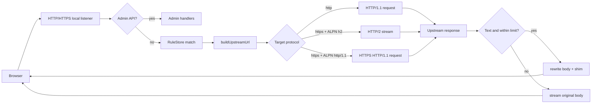
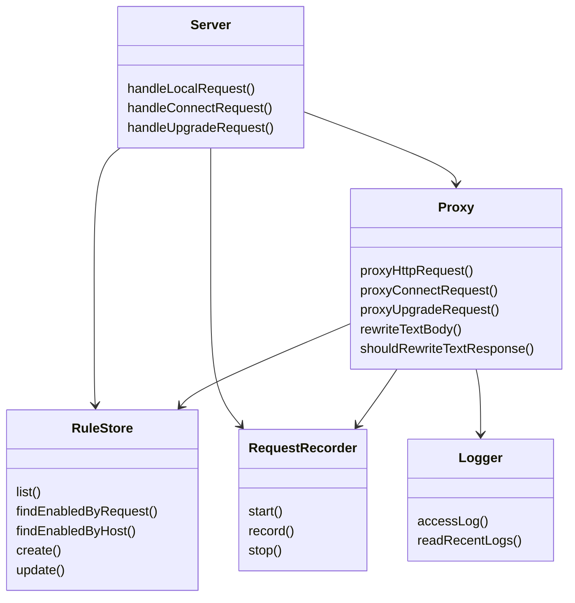

# Proxy Recorder Maintenance Notes

## 本次排查结论

本次按 3 轮 review 做了代码回看、风险修正和测试补齐：

1. 第一轮：检查 HTTPS / HTTP2 / WebSocket upgrade / 大文本改写 / 配置解析 / 跨平台 dev 脚本的改动必要性。
2. 第二轮：修正发现的边界问题，并为风险路径补回归测试。
3. 第三轮：复查可维护性、职责边界、测试覆盖和文档缺口。

当前核心改动是必要的：它们补齐 HTTPS 入口、HTTP/2 upstream、WebSocket upgrade、跨平台 hosts/dev 路径和日志容错能力。新增修正集中在两个运行时风险上：

- 未知 `content-length` 的文本响应原先仍可能完整 buffer 到内存；现在超过 `MAX_REWRITE_BYTES` 会自动降级为原样流式转发。
- WebSocket upgrade 原先在未读取 upstream 响应前就记录为 `101`；现在解析 upstream HTTP 响应状态后再记录和转发。

## 问题与影响

| 问题 | 影响 | 当前处理 |
| --- | --- | --- |
| HTTPS 本地入口和 HTTP upstream 混用时，URL 改写容易把 scheme 写错 | 浏览器资源、Ajax、WebSocket 可能绕过本地代理或被 mixed content 拦截 | `publicOrigin` 按本地入口协议生成，上游 target scheme 独立决定转发客户端 |
| HTTP/2-only HTTPS upstream 不能用 `https.request` 访问 | h2-only 站点资源无法代理 | TLS ALPN 协商到 `h2` 后走 `node:http2` |
| 文本响应改写需要 buffer body | 大文件或未知长度 chunked 文本可能造成高内存占用 | 有 `content-length` 时预判，未知长度时超过阈值降级流式转发 |
| WebSocket upgrade 需要 raw socket 代理 | runtime shim 改写了 `WebSocket` URL，但 server 不处理 `upgrade` 会断链 | `proxyUpgradeRequest` 转发握手和后续字节流 |
| WebSocket upstream 非 101 响应被误记为成功 | 录制和日志误导排查 | 先解析 upstream 响应头状态，再记录实际 status |
| 日志文件可能有坏 JSONL 行 | Admin 日志页面可能整体失败 | `readRecentLogs` 跳过坏行，空文件和缺失文件返回空数组 |
| Mac / Windows hosts 路径不同 | hosts 写入默认路径错误 | `defaultHostsPath` 按平台分支处理 |

## 关键文件

| 文件 | 职责 |
| --- | --- |
| `src/config.ts` | 解析端口、HTTPS 三件套、hosts 默认路径、`MAX_REWRITE_BYTES` |
| `src/server.ts` | 创建 HTTP/HTTPS listener，复用 admin、普通代理、CONNECT、upgrade 入口 |
| `src/proxy.ts` | HTTP/1.1、HTTP/2、CONNECT、WebSocket upgrade 转发和响应改写 |
| `src/rules.ts` | 规则归一化、host/mount 匹配、host label 校验 |
| `src/logger.ts` | JSONL access log 写入和容错读取 |
| `scripts/dev.mjs` | 跨平台启动 `tsx watch src/server.ts` |
| `src/*.test.ts`, `scripts/*.test.mjs` | 单元和集成回归测试 |

## 核心设计

代理入口和上游目标是两层独立概念：

- 本地入口协议决定页面看到的 `publicOrigin`，例如 `https://localhost:3443`。
- 规则里的 `target` 决定真正 upstream 使用 `http`、`https`、HTTP/1.1 或 HTTP/2。
- 响应 body 只在文本类型且大小受控时改写；否则保持 headers/body 原样流式转发。
- WebSocket 不走普通 HTTP response body 改写，而是 raw socket upgrade 隧道。

### 数据流



### Upgrade 调用时序

```mermaid
sequenceDiagram
  participant B as Browser
  participant L as Local proxy
  participant R as RuleStore
  participant U as Upstream
  B->>L: GET /app/socket Upgrade: websocket
  L->>R: findEnabledByRequest(host, path)
  R-->>L: matched rule
  L->>U: raw HTTP upgrade request
  U-->>L: HTTP/1.1 101 or error status
  L->>L: parse status and record actual result
  L-->>B: forward upstream response head
  alt status is 101
    B<->>U: bidirectional tunneled bytes
  else upstream rejected
    L-->>B: forward rejection response
  end
```

### 架构关系



## 使用方法

开发启动：

```bash
npm run dev
```

默认开发端口是 `3333`，可以覆盖：

```bash
PROXY_PORT=8080 npm run dev
```

启用 HTTPS 本地代理必须同时提供端口、证书和私钥：

```bash
HTTPS_PROXY_PORT=3443 \
TLS_CERT_PATH=./certs/localhost.pem \
TLS_KEY_PATH=./certs/localhost-key.pem \
npm run dev
```

控制文本改写最大 buffer：

```bash
MAX_REWRITE_BYTES=10485760 npm start
```

## 测试覆盖

当前验证命令：

```bash
npm test
```

覆盖重点：

- 配置解析：端口、正整数、HTTPS 三件套、Mac/Linux/Windows hosts 默认路径。
- 日志读取：缺失、空文件、坏 JSONL 行、非法 limit。
- URL/body 改写：HTTP/HTTPS origin、mount path、外部 absolute/root-relative URL、runtime shim。
- 大文本响应：超过改写阈值后原样流式转发，不注入 shim。
- WebSocket upgrade：成功 101 隧道转发、upstream 拒绝时记录真实 status。
- HTTP/2 upstream：ALPN 协商到 h2 后请求、响应头转换和文本改写。
- 规则：host label 边界、长度限制、重复路由、mount 优先级和 fallback。
- dev 脚本：Mac/Linux 使用 `tsx`，Windows 使用 `tsx.cmd`。

## 剩余风险

- HTTP/2 trailer、server push、长时间并发 stream 尚未专项覆盖。
- HTTPS upstream WebSocket 的真实 TLS upgrade 路径未单独集成测试；当前实现使用标准 `tls.connect` 后写 raw upgrade 请求。
- 浏览器侧 CSP、SRI、service worker、证书绑定仍可能阻止注入 shim 或本地代理资源。
- 大文本未知长度降级会保留已经 buffer 的阈值内数据再接管 stream；这避免无限 buffer，但超过阈值的响应不会做 URL 改写。
- CONNECT 当前仍按 host 规则做基础隧道，未做 HTTP/2 CONNECT 或更复杂代理认证场景。

## 维护原则

- 不要把本地入口协议和 upstream target 协议耦合在一起。
- 新增 body 改写能力时必须先考虑大小上限、压缩编码和流式降级。
- WebSocket/CONNECT 这类隧道路径不要复用普通 response body 改写逻辑。
- 新增跨平台脚本时优先使用 Node 标准库，避免 shell-only 写法。
- 修改代理协议栈后至少运行 `npm test`，并为新增边界路径补回归测试。
