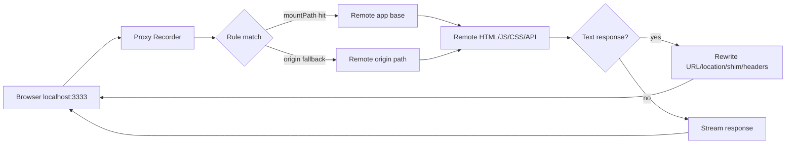
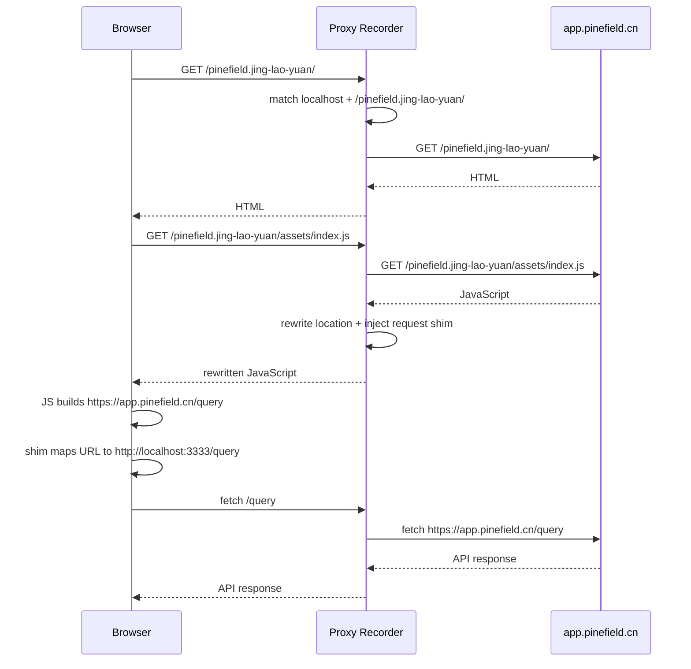
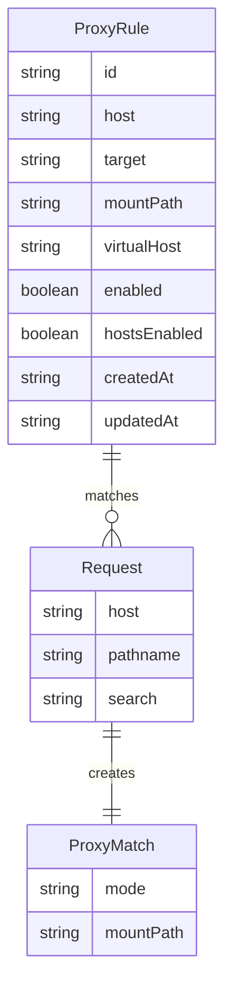
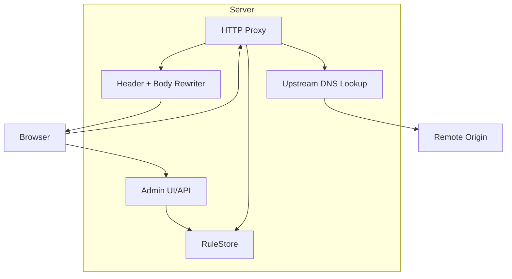

# Local Path Proxy To Remote App

## 问题

目标是用本地地址访问远端 SPA：

```text
http://localhost:3333/pinefield.jing-lao-yuan/#/
```

实际效果尽量等价于：

```text
https://app.pinefield.cn/pinefield.jing-lao-yuan/#/
```

原实现是 Host 级代理：按浏览器请求里的 `Host` 精确匹配规则，再把 path/query 拼到 `target` 后面。这种方式适合 `hosts + mkcert` 伪装真实域名，但不适合 `localhost/<app>/` 这种路径挂载场景。

主要问题：

- `localhost` 访问时，远端 JS 会读取 `location.hostname`，从而走本地/测试环境分支。
- HTML/JS/CSS 里的绝对远端 URL 不会自动回到本地代理。
- `Location`、`Set-Cookie`、`Content-Security-Policy` 等响应头不适配本地代理环境。
- `/api/*` 原先全部被管理接口抢占，远端应用自己的 `/api/...` 无法转发。
- 上游 DNS lookup 需要兼容 Node 在不同平台/调用路径下的 callback shape。

## 影响

不改造时，首屏 HTML 和相对静态资源可能偶尔可用，但无法保证完整应用可用：

- 动态 API 可能直接打远端，绕过本地代理。
- 远端应用可能因为 `location.hostname === "localhost"` 切换到错误环境。
- 远端 cookie、跳转、CSP 可能导致登录、鉴权、资源加载失败。
- 在 Windows/macOS/Linux 上，Node 网络栈触发不同 lookup 形态时可能出现上游连接失败。

## 核心思路

新增“路径挂载代理”能力，同时保留原 Host 代理。

规则新增字段：

```json
{
  "host": "localhost",
  "target": "https://app.pinefield.cn/pinefield.jing-lao-yuan",
  "mountPath": "/pinefield.jing-lao-yuan/",
  "virtualHost": "app.pinefield.cn",
  "enabled": true,
  "hostsEnabled": false
}
```

含义：

- `host`: 本地请求 Host，通常是 `localhost`。
- `target`: 远端应用真实 base URL。
- `mountPath`: 本地挂载路径。
- `virtualHost`: JS 运行时看到的虚拟 hostname，用来让远端应用按线上域名判断环境。
- `hostsEnabled`: localhost 场景通常不需要写 hosts。

## 关键文件

- `src/types.ts`: 规则模型新增 `mountPath`、`virtualHost`。
- `src/rules.ts`: 新增按 host + mount path 匹配规则；保留旧的 host-only 匹配。
- `src/proxy.ts`: 新增路径挂载转发、文本响应改写、响应头改写、JS runtime shim。
- `src/server.ts`: 管理 API 从 `/api/*` 泛匹配改为精确管理接口，避免抢占远端应用 API。
- `src/upstream-lookup.ts`: 兼容 Node lookup 的普通 callback 和 `all: true` callback 形态。
- `src/ui.ts`: 管理界面新增 Mount 和 Virtual Host 输入。
- `src/*.test.ts`: 覆盖规则匹配、URL 改写、shim 注入、lookup 兼容等关键路径。

## 数据流动



## 调用时序



## 数据关系



## 架构



## 使用方法

安装并构建：

```bash
npm install
npm run build
```

启动本地端口：

```bash
PROXY_PORT=3333 npm start
```

打开管理界面：

```text
http://localhost:3333/admin
```

添加规则：

```text
Host: localhost
Target: https://app.pinefield.cn/pinefield.jing-lao-yuan
Mount: /pinefield.jing-lao-yuan/
Virtual Host: app.pinefield.cn
Enabled: checked
Write hosts: unchecked
```

访问：

```text
http://localhost:3333/pinefield.jing-lao-yuan/#/
```

说明：`#/` 是浏览器 fragment，不会发送给服务器；代理实际收到的是 `/pinefield.jing-lao-yuan/`。

## 跨平台注意事项

- `localhost:3333` 模式不需要写 hosts，也不需要管理员权限；macOS、Windows、Linux 都可以直接跑。
- 如果要监听 80/443，macOS/Linux 通常需要管理员权限；Windows 也可能需要管理员终端或端口授权。
- `HOSTS_PATH` 默认是 `/etc/hosts`，Windows 要写 hosts 时应显式配置为类似 `C:\Windows\System32\drivers\etc\hosts` 的路径，并用管理员权限启动。
- `mkcert` 证书方式仍适合真实域名 HTTPS 拦截，但不是 localhost 路径挂载的必要条件。
- 代码使用 Node 标准 `http/https/dns` 模块；`path.join` 只用于本地数据文件，不参与 URL 拼接，避免 Windows 路径分隔符影响代理 URL。

## 测试覆盖

已运行：

```bash
npm test
```

当前覆盖：

- Host 规则归一化和重复检测。
- disabled rule 不匹配。
- mount path 优先于 host fallback。
- 没有普通 host 规则时，mounted rule 作为 origin fallback 转发 `/query`、`/api/...` 等根路径请求。
- 文本响应中的远端绝对 URL 改写为本地代理 URL。
- 上游 base path 和本地 mount path 不同的改写顺序。
- JS 中 `location.hostname`、`window.location.hostname`、`globalThis.location.hostname` 改写。
- JS runtime shim 注入，包括 `fetch`、`XMLHttpRequest`、`EventSource`、`WebSocket` 的远端 origin 映射。
- DNS lookup 兼容 `lookup(host, callback)` 和 `lookup(host, { all: true }, callback)` 形态。
- hosts 管理块写入。

HTTP 级手工验证：

- `GET http://localhost:3333/pinefield.jing-lao-yuan/` 返回 200。
- `GET http://localhost:3333/pinefield.jing-lao-yuan/assets/index-DTFsrCfk.js` 返回 200。
- JS 响应包含 `__proxyRecorderMapUrl` shim。
- JS 响应包含虚拟 host/origin 改写，且未出现 `window."app.pinefield.cn"` 这类非法代码。
- `GET http://localhost:3333/api/logs` 仍走管理 API。
- 非管理 `/api/not-admin` 会转发给远端，不再被本地管理 API 抢占。

## 测试遗漏和剩余风险

仍未覆盖：

- 浏览器真实执行测试，例如 Playwright 检查页面是否完全渲染、网络请求是否全部通过 localhost。
- 登录态、SSO、跨域 cookie、token refresh 的完整端到端流程。
- gzip/br 上游响应的解压改写路径。目前代理请求上游时强制 `Accept-Encoding: identity`，正常情况下上游应返回未压缩文本。
- sourcemap、worker、manifest、动态 import 的所有变体。
- 大型文本资源的内存压力。当前文本响应会 buffer 后改写，不适合超大流式文本。
- 对 JS 的改写是字符串级，不是 AST 级。已规避已知 `window.location.hostname` 误改问题，但复杂混淆代码仍有风险。

## 必要性评估

必要修改：

- `mountPath`: localhost 路径代理的核心能力。
- `virtualHost`: pinefield 这类根据 hostname 切环境的应用必须有。
- 响应体 URL 改写: 远端绝对资源/API URL 回流本地代理的基础。
- JS shim: 动态构造出来的远端 URL 必须运行时映射，否则会绕过代理。
- 精确管理 API 匹配: 避免抢占远端应用 `/api/*`。
- DNS lookup 兼容: 修复真实请求中的 `Invalid IP address: undefined`，提升跨平台稳定性。

有代价但可接受的修改：

- 移除 CSP 响应头：本地代理需要注入 shim 和改写资源，保留远端 CSP 可能阻断本地调试。
- 改写 `Set-Cookie`: 本地 HTTP 场景需要去掉 `Domain`，并在非 HTTPS 本地访问时去掉 `Secure`，否则浏览器不会存 cookie。
- buffer 文本响应：实现简单、可测试，但不是高吞吐代理设计。

## 回滚路径

原 Host 代理仍保留。要回到原模式：

- 不配置 `mountPath`。
- 继续使用 `Host: app.pinefield.cn`、`Target: https://app.pinefield.cn`。
- 如需 HTTPS 真实域名拦截，继续使用 `mkcert + HTTPS_PROXY_PORT=443`。
